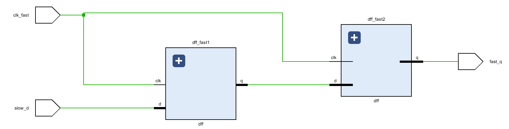
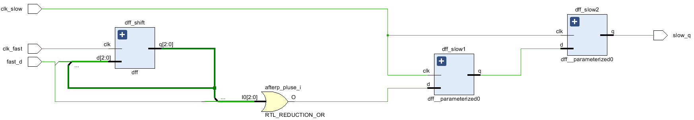
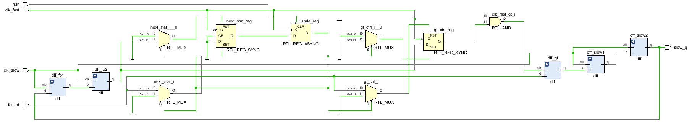

# Clock Domain Crossing (CDC)
概述  
包含单bit同步和多bit同步

---

## 功能介绍
`cdc_slow2fast_1bit.v`：单bit从慢时钟域传递到快时钟域，打两拍。  
  
`cdc_fast2slow_nons_1bit.v`：单bit从快时钟域跨慢时钟域，采用脉冲展宽。  
  
`cdc_fast2slow_s_1bit.v`：单bit从快时钟域跨慢时钟域，采用握手模式。  
  

---